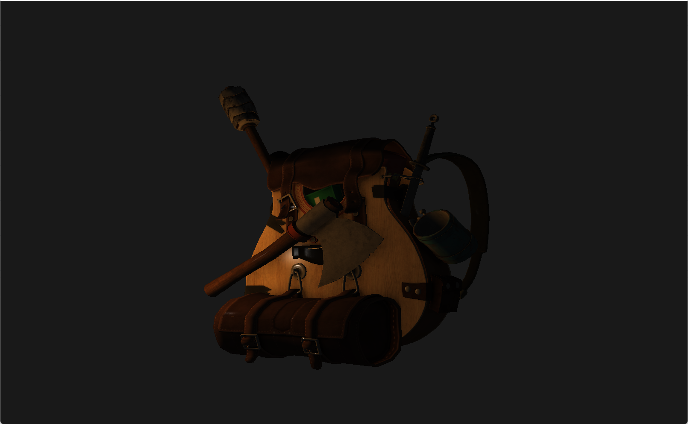
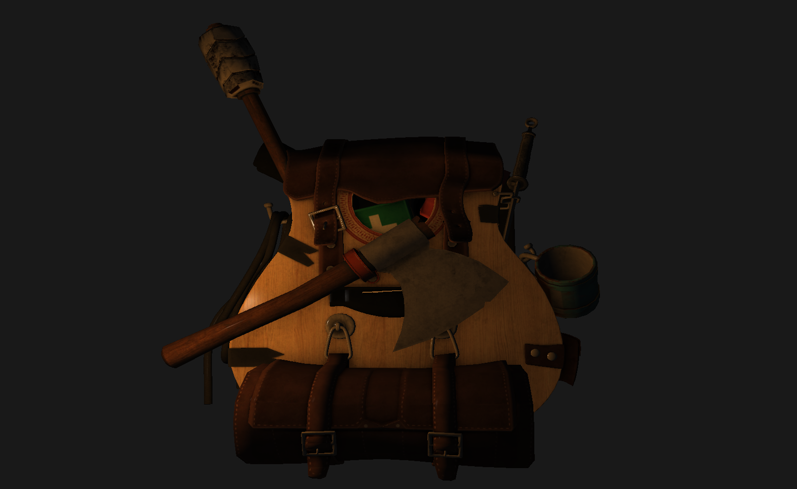
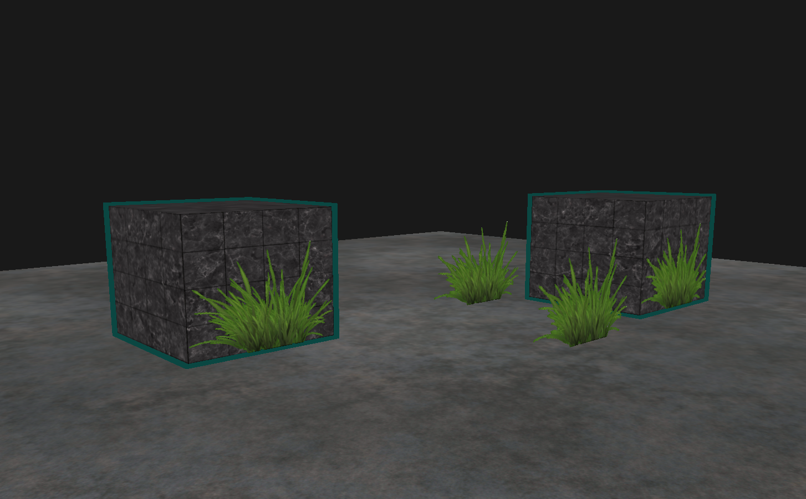

# OpenGL renderer

This is a small OpenGL renderer I wrote following the [LearnOpenGL website](https://learnopengl.com/), in C++. It implements the following features:
* A moving camera controlled through WASD and the scroll wheel.
* Multiple types of lights: directional lights, point lights, and spotlights.
* Basic Blinn-Phong shading.
* Model-loading using the ASSIMP library.
* Object outlining through stencil testing.
* Blending for transparency effects.

## Screenshots

I have since moved on to learning Vulkan, so this project will be on indefinite hold until then.
